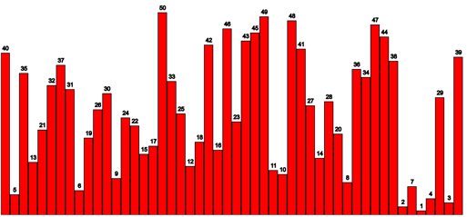
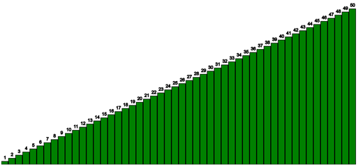

# Sorter Prüfungsspezifikation

## Einführung

In dieser Prüfung werden Sie Ihr Verständnis des **Bubble Sort**-Algorithmus demonstrieren, indem Sie ihn in Code implementieren und visualisieren. Es wird erwartet, dass Sie sowohl den unsortierten (randomisierten) als auch den sortierten Zustand eines Arrays mit einem Balkendiagramm darstellen.

## Programmieraufgaben

### Mindestanforderungen

Ihre Implementierung **muss** die folgenden Punkte erfüllen:

1. **Globale Array-Deklaration**

   * Deklarieren Sie ein Array (vorzugsweise als globale Variable), um eine Zahlensequenz zu speichern.

2. **Array-Initialisierung**

   * Beim Programmstart füllen Sie das Array mit aufeinanderfolgenden Zahlen beginnend bei 1 bis zu einer Obergrenze (z.B. 30).
   * Die Obergrenze sollte **leicht anpassbar** sein (z.B. durch Änderung einer Konstante).
   * Die Array-Werte müssen in **zufälliger Reihenfolge** (gemischt) sein.

3. **Balkendiagramm-Visualisierung**

   * Zeichnen Sie ein Balkendiagramm, das die Zahlen im Array darstellt.
   * Die Reihenfolge der Balken im Diagramm muss der Reihenfolge der Zahlen im Array entsprechen (d.h., wenn das Array `[5, 1, 8]` ist, zeigt das Balkendiagramm Balken für 5, 1 und 8 in dieser Reihenfolge).
   * Beispiel (**Zahlen über den Balken sind in dieser Phase nicht erforderlich**):

     

4. **Sortierung bei Tastendruck**

   * Wenn die **Leertaste** gedrückt wird:

     * Wenden Sie den Bubble Sort-Algorithmus an, um das Array **in aufsteigender Reihenfolge** zu sortieren.
     * Sie **müssen Bubble Sort selbst implementieren**—verwenden Sie keine eingebauten oder Bibliotheks-Sortierfunktionen.
     * Nach dem Sortieren **aktualisieren Sie das Balkendiagramm**, um das sortierte Array widerzuspiegeln.

     Beispiel:

     

### Erweiterte Anforderungen

Um die volle Punktzahl zu erreichen, implementieren Sie **zusätzlich** die folgenden Features:

1. **Funktions-Extraktion**

   * Platzieren Sie Ihren Bubble Sort-Code in einer **separaten Funktion** (nicht direkt in Event-Handlern oder der Hauptlogik).

2. **Zahlen-Beschriftungen**

   * Zeichnen Sie den Wert jeder Zahl **über den jeweiligen Balken**, wie in den obigen Bildern gezeigt.

3. **Wiederholtes Sortieren & Mischen**

   * Nachdem das Array sortiert ist:

     * Wenn der Benutzer erneut die Leertaste drückt, randomisieren (mischen) Sie das Array erneut.
     * Dies ermöglicht es Benutzern, **zwischen Sortieren und Mischen zu wechseln**, indem sie wiederholt die Leertaste drücken.

## Qualitätskriterien

Ihr Code sollte diesen Standards entsprechen:

* **Vermeiden Sie "magische Zahlen"**: Verwenden Sie benannte Konstanten für wichtige Werte (z.B. Array-Größe, Balkenbreite).
* **Minimieren Sie globale Variablen**: Halten Sie Variablen mit begrenztem Gültigkeitsbereich lokal zu Funktionen, wenn möglich.
* **Keine Code-Duplikation**: Lagern Sie wiederholte Logik in wiederverwendbare Funktionen aus. 